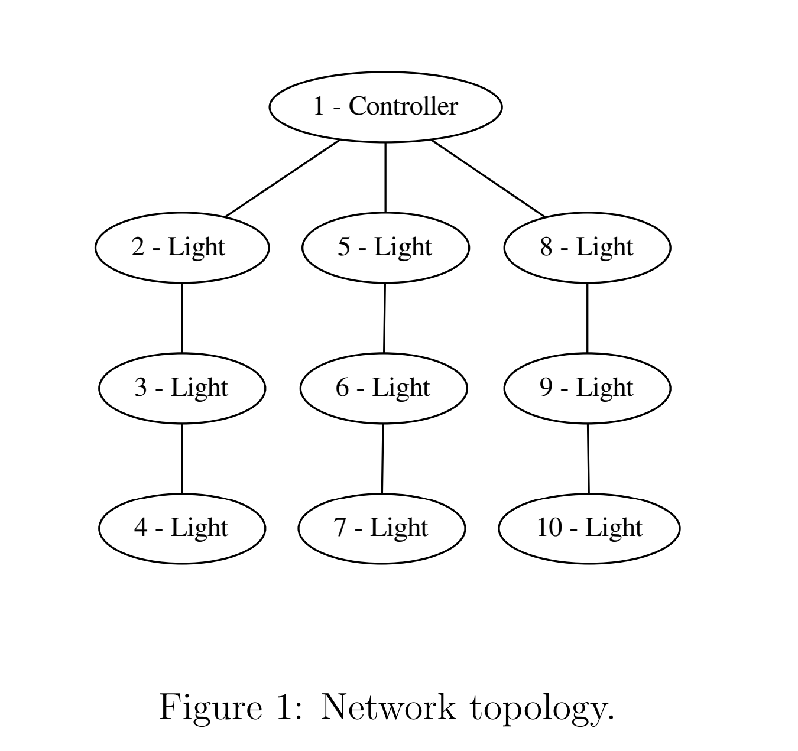
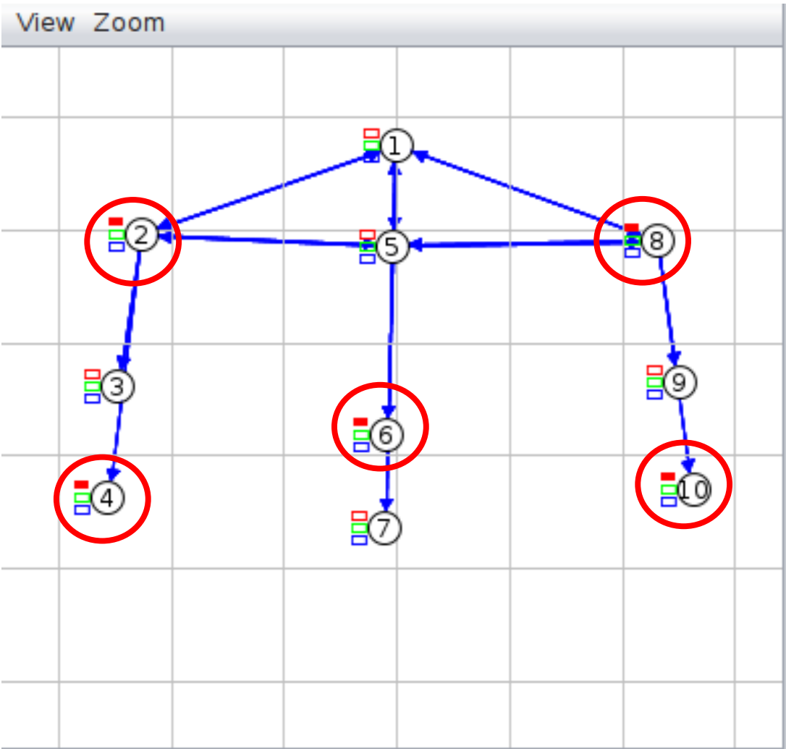
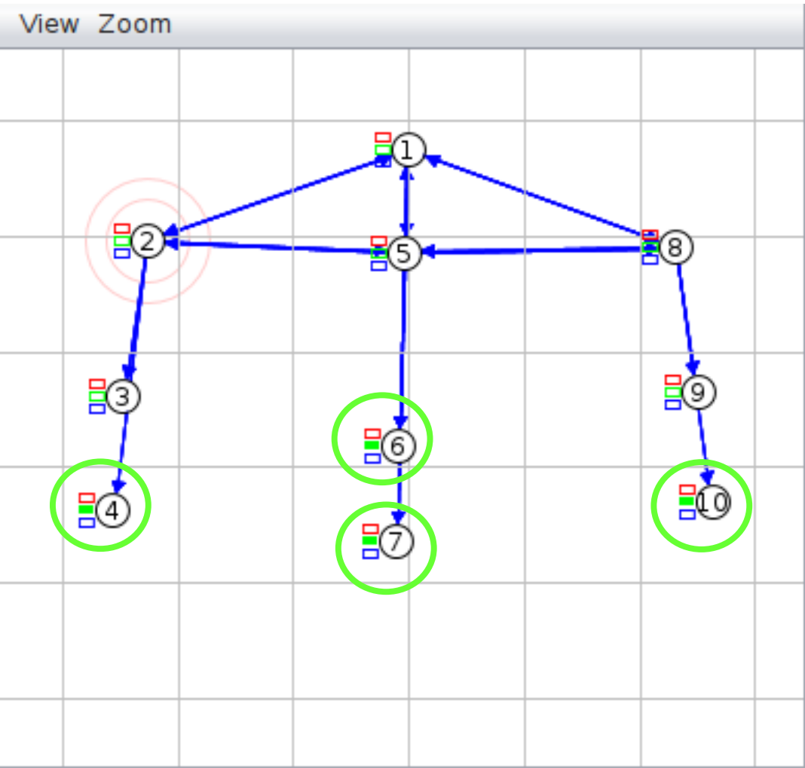
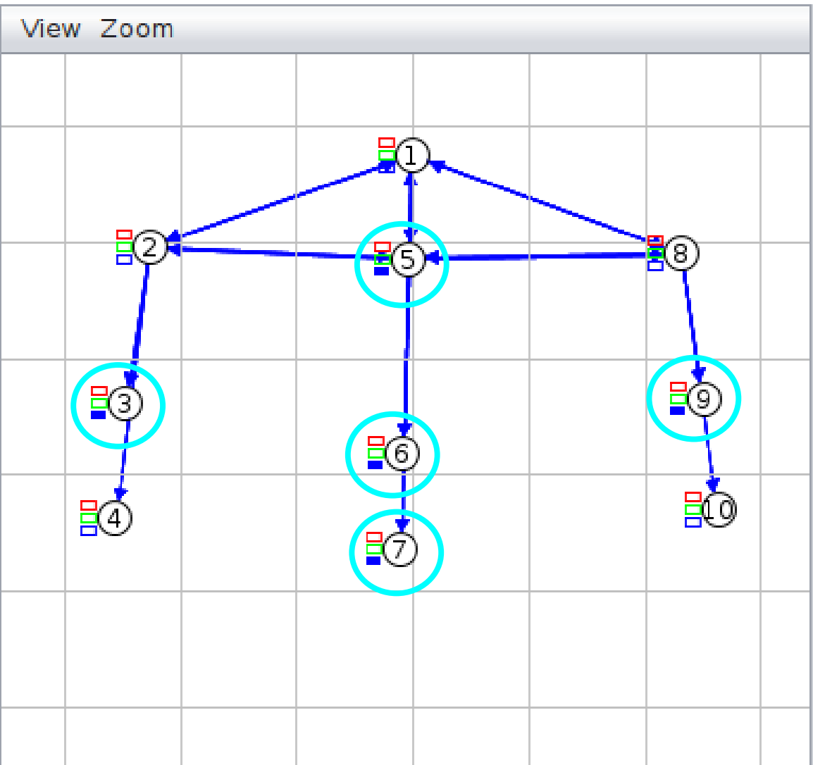
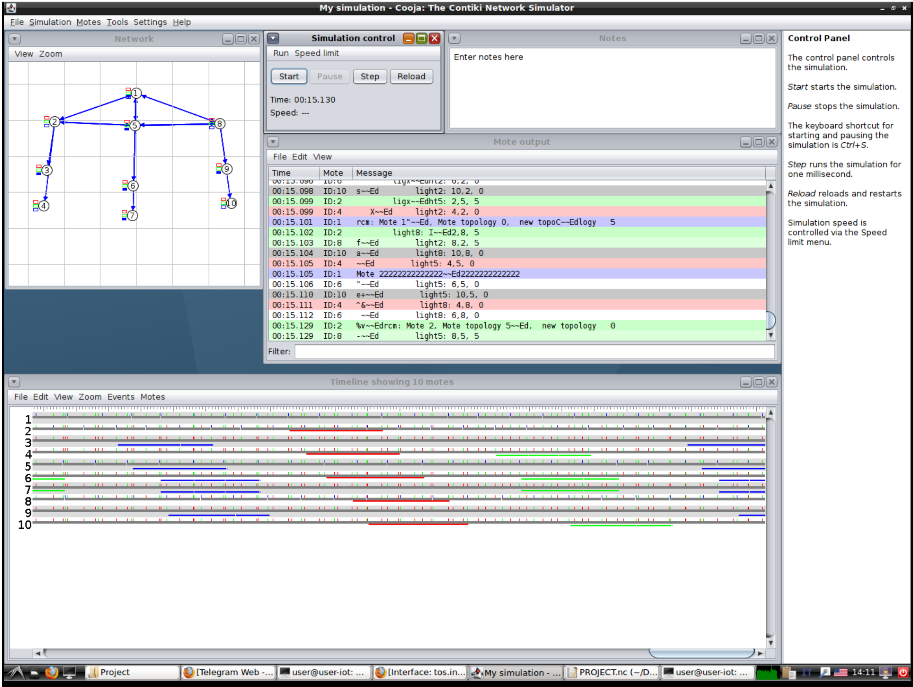

# IoT-SmartLightsWSN-UpTo4Points
 Implementing a network of smart lights, and program the network to visualize luminous pattern inside the predefined topology by using TinyOS.

------------------

**Implementation:** 

There are ten various motes. A primary Controller, three secondary Controllers that are a part of the secondary trees, and six ordinary Motes that only take commands.

There is a Controller (mote 1) that manages the entire system and establishes its topology. Each sub system has a controller that is the primary offspring of the controller (motes 2, 5 and 8). These motes can only observe and transmit information to their offspring. As a result, the controller sends the topology to these 3 motes first, and then the lights on motes 2, 5, and 8 are turned on in accordance with the system's specified topology. The controller sends a reset instruction to the sub controllers to turn off all the LEDs after setting each topology in the system.
Each time a mote is fired, a data packet is sent to a specific mote to turn on or off the lights.

**There are 3 different topologies:** 

1- Cross    ➔ Motes: 2, 4, 6, 8, 10

2- Triangle ➔ Motes: 4, 6, 7, 10

3- Plus     ➔ Motes: 3, 5, 6, 7, 9

Reset states:

In this study, we simulate these system topologies using COOJA. (The arrows in the pictures are only a result of certain motes being within range of others but not receiving the data from that mote.)

The final project folder contains a result file that displays the project's print log.
